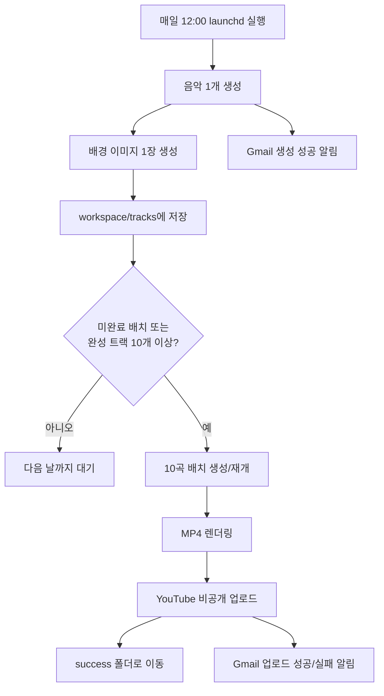

# AutoMusic

AutoMusic은 브라질리언 폰크 스타일의 운동용 음악을 매일 1개씩 생성하고, 배경 이미지를 만든 뒤, 10개가 모이면 하나의 MP4로 합쳐 YouTube에 비공개 업로드하는 로컬 자동화 파이프라인입니다.

음악과 이미지 프롬프트는 variant 기반으로 매번 조금씩 달라집니다. 음악 variant는 BPM, 무드, 악기, 질감과 함께 인트로, 빌드업, 드롭, 브레이크다운, 클라이맥스, 아웃트로 구조를 포함합니다. 참고곡 제목을 API 프롬프트에 직접 넣지 않고, 안전한 스타일 설명으로 변환해 사용합니다.

## 문서

- [문서 홈](docs/README.md)
- [프로그램 가이드](docs/program-guide.md)
- [보안 및 커밋 안전 가이드](docs/security.md)
- [이전 한국어 가이드 경로](docs/program-guide.ko.md)

## 로컬 음악 생성 마법사

브라우저에서 프리셋과 프롬프트를 선택해 음악, 이미지, 단일 영상 파일을 만들 수 있습니다.
YouTube 업로드와 매일 자동 실행은 이 명령으로 활성화되지 않습니다.

```bash
.venv/bin/python scripts/run_web.py
```

브라우저에서 [http://127.0.0.1:8765](http://127.0.0.1:8765)를 엽니다. 자세한 사용법과 비용 안내는 [프로그램 가이드](docs/program-guide.md#로컬-웹-음악-생성기)를 참고하세요.

## 전체 흐름



## 현재 상태

- macOS `launchd`에 매일 `12:00` 실행 작업이 등록되어 있습니다.
- 현재 브랜치: `codex/automusic-pipeline`
- 원격 브랜치: `origin/codex/automusic-pipeline`
- 상세 운영 방법은 [프로그램 가이드](docs/program-guide.md)를 기준으로 확인합니다.

## 설치

의존성을 설치합니다.

```bash
python3 -m pip install -r requirements.txt
```

`.env.example`을 복사해 `.env`를 만들고 실제 값을 채웁니다.

```bash
GEMINI_API_KEY=
OPENAI_API_KEY=
YOUTUBE_CLIENT_ID=
YOUTUBE_CLIENT_SECRET=
YOUTUBE_REFRESH_TOKEN=
SMTP_HOST=smtp.gmail.com
SMTP_PORT=587
SMTP_USERNAME=
SMTP_PASSWORD=
SMTP_FROM_EMAIL=
SMTP_TO_EMAIL=
SMTP_USE_TLS=true
```

`.env`, token 파일, 생성된 미디어, `workspace/`, `success/`는 커밋하면 안 됩니다.

SMTP 설정은 선택입니다. 설정하면 실제 하루 생성 성공/실패, 배치 업로드 성공/실패 시 Gmail 알림을 받습니다.

YouTube 업로드 대상 채널은 `YOUTUBE_REFRESH_TOKEN`이 발급된 채널로 결정됩니다. 한 계정에 채널이 여러 개라면 [프로그램 가이드 - YouTube 업로드](docs/program-guide.md#youtube-업로드)를 기준으로 원하는 채널의 OAuth token을 발급해 사용합니다.

## 드라이런

외부 API 호출 없이 테스트용 음악 1개와 이미지를 만듭니다.

```bash
python3 scripts/run_daily.py --config configs/examples/music.yaml --dry-run
```

`workspace/tracks/` 아래에 `imaged` 상태 트랙 10개가 있을 때 외부 API 호출 없이 배치 흐름을 테스트합니다.

```bash
python3 scripts/run_batch_upload.py --config configs/examples/upload.yaml --dry-run
```

## 실제 실행

실제 음악 1개와 OpenAI 배경 이미지를 생성합니다.

```bash
python3 scripts/run_daily.py --config configs/examples/music.yaml
```

10개 트랙이 준비되면 렌더링, YouTube 비공개 업로드, 성공 폴더 이동까지 실행합니다.

```bash
python3 scripts/run_batch_upload.py --config configs/examples/upload.yaml
```

## macOS 매일 정오 자동 실행

현재 개발 환경은 macOS이므로 `systemd timer`가 아니라 `launchd`를 사용합니다.

```bash
python3 scripts/install_launchd.py
```

설치 후 매일 로컬 시간 `12:00`에 `scripts/run_automation.py`가 실행됩니다. 이 스크립트는 하루 생성 후 미완료 배치가 있거나 완성 트랙이 10개 이상이면 배치 업로드까지 진행합니다.

자주 쓰는 명령:

```bash
launchctl print gui/$(id -u)/com.automusic.daily
launchctl start com.automusic.daily
tail -f logs/launchd.out.log logs/launchd.err.log
launchctl unload ~/Library/LaunchAgents/com.automusic.daily.plist
```

## 단계별 실행

필요하면 파이프라인을 단계별로 실행할 수 있습니다.

```bash
python3 scripts/generate_music.py --config configs/examples/music.yaml
python3 scripts/generate_image.py workspace/tracks/<track-id> --config configs/examples/music.yaml
python3 scripts/build_batch.py
python3 scripts/render_video.py workspace/batches/<batch-id>
python3 scripts/upload_youtube.py workspace/batches/<batch-id> --config configs/examples/upload.yaml
```

## 검증

테스트를 실행합니다.

```bash
python3 -m unittest discover -s tests -v
```

커밋 전 staged 비밀값 스캔을 실행합니다.

```bash
git grep --cached -n -i -E "(api[_-]?key|secret|refresh[_-]?token|access[_-]?token|client[_-]?secret|authorization:|bearer )" -- .
```
