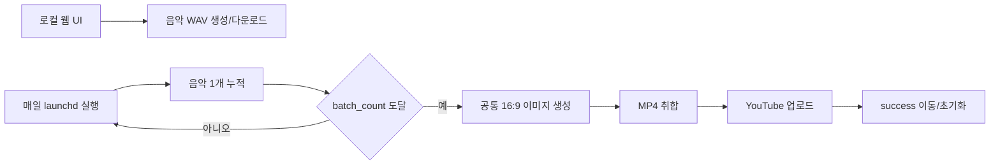

# AutoMusic

Lyria 기반 음악 자동 생성 프로젝트입니다. 수동 웹 생성과 스케줄러 기반 YouTube 배치 업로드를 분리합니다.



## 빠른 시작

```bash
cd /Users/dglee/workspace/autoMusic
python3 -m venv .venv
.venv/bin/python -m pip install -r requirements.txt
cp .env.example .env
.venv/bin/python scripts/run_web.py
```

웹 UI: [http://127.0.0.1:8765](http://127.0.0.1:8765)

웹에서는 이미지·영상을 생성하지 않고 음악 WAV만 제공합니다. 전체 운영 방법은 [운영 가이드](docs/program-guide.md)를 참고하세요.

## 자동화

`configs/category.conf`의 `music_category`를 읽어 선택된 카테고리 YAML을 사용합니다. 현재 카테고리는 `phonk`, `study`, `fitness`, `cafe`, `lofi`이며, `configs/categories/`에 YAML을 추가해 확장할 수 있습니다. `batch_count`, 장르, 분위기, 악기, 음악 arrangement, 이미지 주제를 읽어 매일 실행하며, 설정 개수에 도달하면 배치 공통 이미지 1장을 만들고 전체 트랙을 MP4로 취합해 YouTube에 업로드합니다.

```bash
.venv/bin/python scripts/run_automation.py \
  --project-root /Users/dglee/workspace/autoMusic
```

macOS 스케줄러 등록:

```bash
.venv/bin/python scripts/install_launchd.py \
  --project-root /Users/dglee/workspace/autoMusic \
  --hour 12 --minute 0
```

## 문서

- [전체 운영 가이드](docs/program-guide.md)
- [보안 및 커밋 안전 가이드](docs/security.md)
- [문서 홈](docs/README.md)

생성 결과는 `workspace/`에서 작업되고, YouTube 업로드와 아카이브가 모두 성공하면 `success/`로 이동합니다. API 키와 OAuth 토큰은 환경변수로만 읽습니다.
