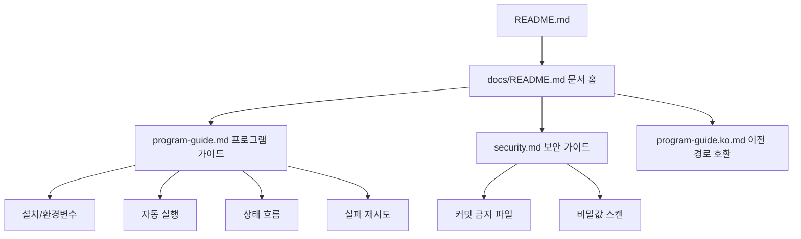

# AutoMusic 문서 홈

GitHub에서 보기 좋은 위키형 문서 인덱스입니다. 운영 절차는 [프로그램 가이드](program-guide.md)를 기준으로 관리합니다.

## 문서 목록

| 문서 | 설명 |
| --- | --- |
| [프로그램 가이드](program-guide.md) | 설치, 실행, 자동화, 상태 흐름, 실패 재시도, 검증 절차 |
| [보안 및 커밋 안전 가이드](security.md) | API 키, OAuth 토큰, SMTP 비밀번호, 생성물 커밋 방지 |
| [이전 한국어 가이드 경로](program-guide.ko.md) | 기존 링크 호환용 문서. 최신 가이드는 `program-guide.md` |

## 문서 구조

## 운영자가 자주 보는 항목

- 매일 자동 실행 설치: [프로그램 가이드 - macOS 매일 정오 자동 실행](program-guide.md#macos-매일-정오-자동-실행)
- 실패 후 재시도: [프로그램 가이드 - 실패와 재시도](program-guide.md#실패와-재시도)
- Gmail 알림 조건: [프로그램 가이드 - Gmail 알림](program-guide.md#gmail-알림)
- 커밋 전 보안 점검: [보안 및 커밋 안전 가이드](security.md)
