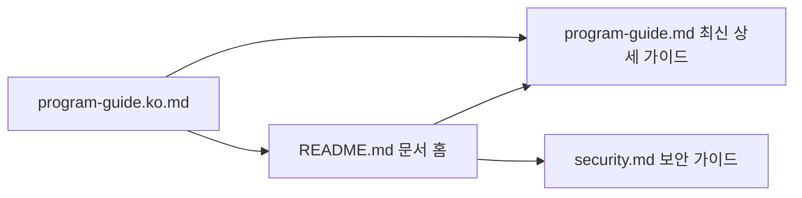

# AutoMusic 한국어 가이드

이 파일은 기존 링크 호환을 위한 한국어 문서입니다.

최신 운영 문서는 [프로그램 가이드](program-guide.md)로 통합했습니다. GitHub에서 위키처럼 탐색하려면 [문서 홈](README.md)을 먼저 확인하세요.

## 문서 이동 흐름

## 바로가기

- [프로그램 가이드](program-guide.md)
- [문서 홈](README.md)
- [보안 및 커밋 안전 가이드](security.md)
