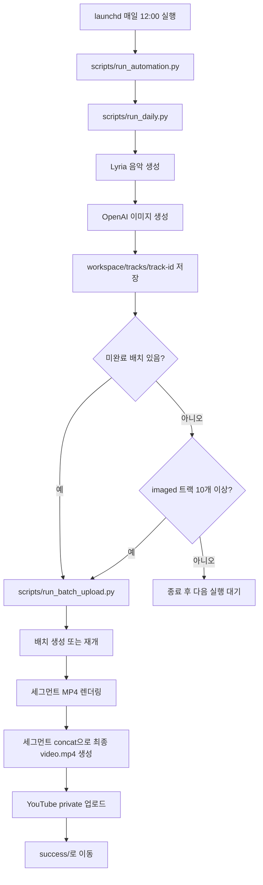
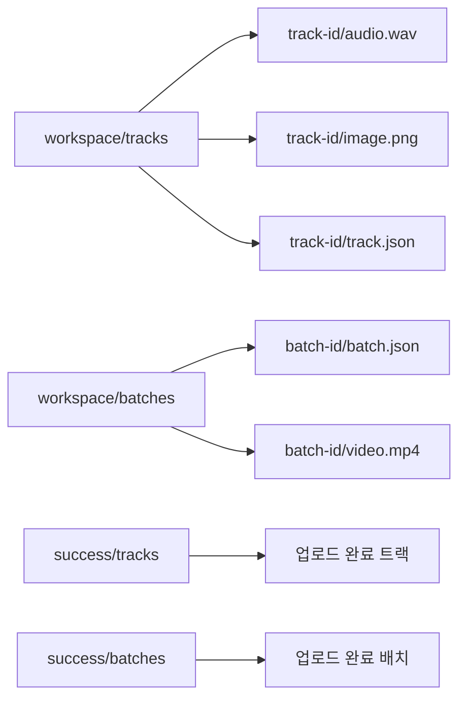
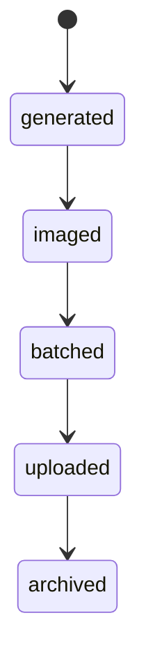
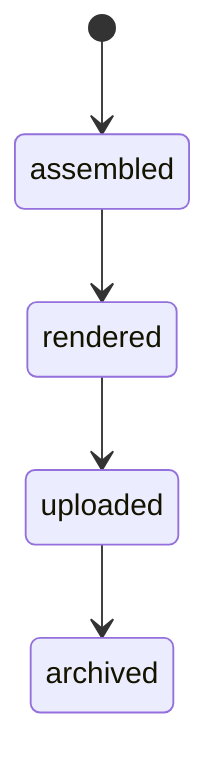
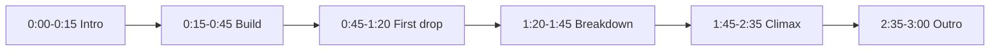
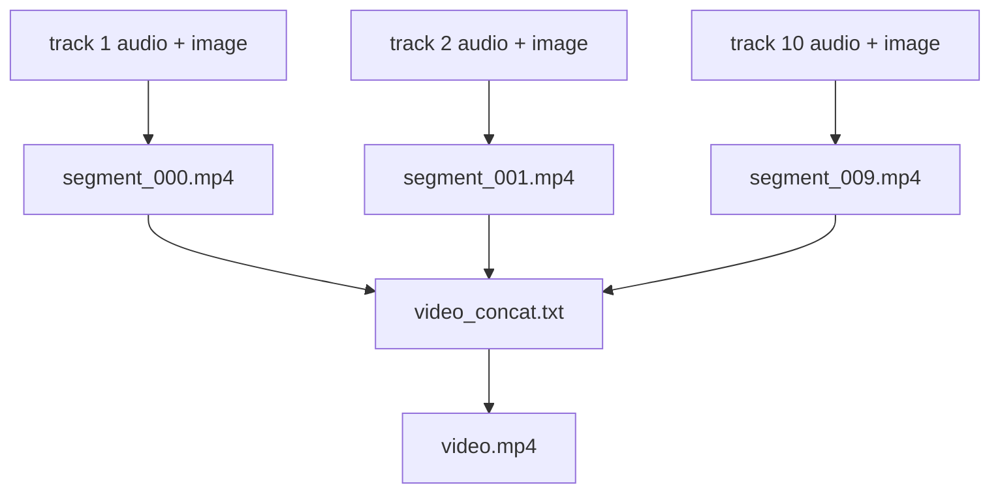
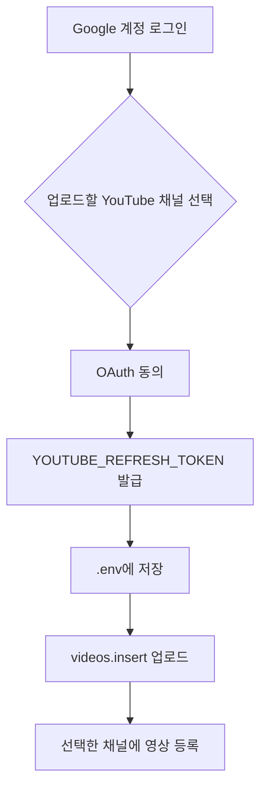
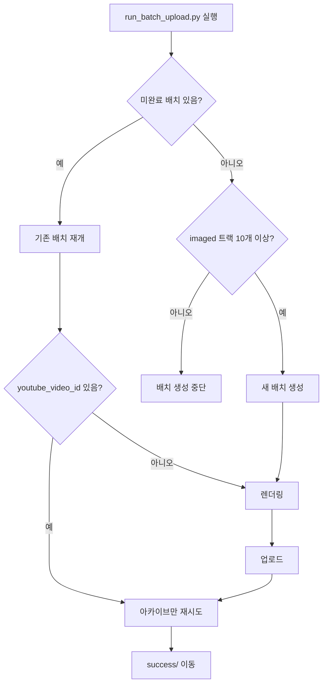

# AutoMusic 프로그램 가이드

AutoMusic은 브라질리언 폰크 스타일의 운동용 음악 영상을 자동 생성하기 위한 로컬 파이프라인입니다. 하루에 음악 1개와 배경 이미지 1장을 만들고, 완성 트랙 10개가 모이면 하나의 긴 MP4로 렌더링해 YouTube에 비공개 업로드한 뒤 `success/`에 보관합니다.

## 현재 가능한 기능

구현됨:

- Google Gemini Lyria로 하루 음악 트랙 1개 생성
- OpenAI 이미지 API로 16:9 배경 이미지 1장 생성
- 각 트랙을 `workspace/tracks/` 아래 구조화된 폴더로 저장
- 완료된 트랙 중 가장 오래된 10개를 선택해 배치 생성
- 실패한 미완료 배치가 있으면 새 배치보다 먼저 재시도
- `ffmpeg`로 배치 MP4 렌더링
- YouTube에 `private` 영상으로 업로드
- 업로드 성공한 트랙과 배치를 `success/`로 이동
- 외부 API를 호출하지 않는 `--dry-run` 모드 지원
- 음악/이미지 프롬프트 variant를 매 실행마다 선택
- Gmail SMTP 성공/실패 알림
- macOS `launchd` 기반 매일 12:00 자동 실행

아직 미구현:

- 배경 이미지에 줌, 팬, 글로우, 그레인 같은 애니메이션 효과 적용
- 재사용 가능한 실제 GIF 산출물 생성

## 실행 위치

현재 구현은 worktree 브랜치에 있습니다.

```bash
cd /Users/dglee/workspace/autoMusic/.worktrees/automusic-pipeline
```

## 설치

```bash
python3 -m pip install -r requirements.txt
```

가상환경을 사용하는 경우:

```bash
python3 -m venv .venv
. .venv/bin/activate
python -m pip install -r requirements.txt
```

## 환경변수

API 키와 OAuth 값은 `.env` 또는 셸 환경변수에서 읽습니다. 실제 값은 커밋하면 안 됩니다.

음악 생성:

```bash
GEMINI_API_KEY=
```

이미지 생성:

```bash
OPENAI_API_KEY=
```

YouTube 업로드:

```bash
YOUTUBE_CLIENT_ID=
YOUTUBE_CLIENT_SECRET=
YOUTUBE_REFRESH_TOKEN=
```

YouTube 업로드는 API key가 아니라 OAuth refresh token을 사용합니다. Google Cloud Console에서는 다음 위치를 확인합니다.

| 확인 항목 | Google Cloud Console 위치 |
| --- | --- |
| YouTube Data API v3 활성화 | `APIs & Services` > `Enabled APIs & services` |
| OAuth Client ID/Secret | `APIs & Services` > `Credentials` |
| quota 사용량과 제한 | `APIs & Services` > `YouTube Data API v3` > `Quotas & System Limits` |
| API 요청 통계 | `APIs & Services` > `YouTube Data API v3` > `Metrics` |

Gmail 알림:

```bash
SMTP_HOST=smtp.gmail.com
SMTP_PORT=587
SMTP_USERNAME=
SMTP_PASSWORD=
SMTP_FROM_EMAIL=
SMTP_TO_EMAIL=
SMTP_USE_TLS=true
```

`.env.example`을 복사해 `.env`를 만들고 실제 값을 넣습니다. `.env`는 `.gitignore`에 의해 커밋되지 않습니다.

## 전체 파이프라인



## 주요 명령

하루 생성 dry-run:

```bash
python3 scripts/run_daily.py --config configs/examples/music.yaml --dry-run
```

실제 하루 생성:

```bash
python3 scripts/run_daily.py --config configs/examples/music.yaml
```

이미지 생성만 별도 실행:

```bash
python3 scripts/generate_image.py workspace/tracks/<track-id> --config configs/examples/music.yaml
```

10곡 배치 dry-run:

```bash
python3 scripts/run_batch_upload.py --config configs/examples/upload.yaml --dry-run
```

실제 배치 렌더링, 업로드, 아카이브:

```bash
python3 scripts/run_batch_upload.py --config configs/examples/upload.yaml
```

## macOS 매일 정오 자동 실행

현재 머신은 macOS이므로 `systemd timer` 대신 `launchd`를 사용합니다. `cron`도 가능하지만 macOS에서는 LaunchAgent와 로그 관리가 더 안정적인 `launchd`를 권장합니다.

매일 낮 `12:00` 실행을 설치하거나 갱신:

```bash
python3 scripts/install_launchd.py
```

설치 내용:

- LaunchAgent 경로: `~/Library/LaunchAgents/com.automusic.daily.plist`
- 실행 시각: 매일 macOS 로컬 시간 `12:00`
- 실행 명령: `.venv/bin/python scripts/run_automation.py --project-root <project-root>`
- 로그 파일: `logs/launchd.out.log`, `logs/launchd.err.log`

상태 확인과 수동 실행:

```bash
launchctl print gui/$(id -u)/com.automusic.daily
launchctl start com.automusic.daily
tail -f logs/launchd.out.log logs/launchd.err.log
```

스케줄 해제:

```bash
launchctl unload ~/Library/LaunchAgents/com.automusic.daily.plist
```

## 폴더 구조



작업 중 산출물:

```text
workspace/
  tracks/
    <track-id>/
      audio.wav
      image.png
      track.json
  batches/
    <batch-id>/
      batch.json
      segment_000.mp4
      segment_001.mp4
      video_concat.txt
      video.mp4
```

업로드 성공 후 보관:

```text
success/
  tracks/
    <track-id>/
      audio.wav
      image.png
      track.json
  batches/
    <batch-id>/
      batch.json
      video.mp4
```

## 상태 흐름

트랙 상태:



배치 상태:



주요 트랙 필드:

- `track_id`: 트랙 폴더 이름
- `status`: 현재 상태
- `music_prompt`: 음악 생성 최종 프롬프트
- `image_prompt`: 이미지 생성 최종 프롬프트
- `duration_seconds`: 실제 오디오 길이
- `audio_path`: 보통 `audio.wav`
- `image_path`: 보통 `image.png`
- `batch_id`: 배치 포함 후 기록되는 배치 ID
- `created_at`: 생성 시각

주요 배치 필드:

- `batch_id`: 배치 폴더 이름
- `status`: 현재 상태
- `track_ids`: 배치에 포함된 10개 트랙 ID
- `video_path`: 보통 `video.mp4`
- `youtube_video_id`: YouTube 업로드 성공 후 기록되는 영상 ID
- `archive_pending`: 업로드는 됐지만 `success/` 이동이 남았는지 여부
- `created_at`: 배치 생성 시각

## 프롬프트 구조

음악 프롬프트는 `configs/examples/music.yaml`의 구조화된 필드로 만듭니다.

- `genre`
- `bpm_min`
- `bpm_max`
- `mood`
- `instruments`
- `texture`
- `vocals`
- `temperature`
- `lyria_retries`
- `lyria_retry_delay_seconds`
- `negative_rules`
- `prompt_variants`
- `prompt_variants[].arrangement`

기본 방향은 운동용 브라질리언 폰크입니다.

```text
Brazilian phonk, aggressive workout energy, distorted 808 bass,
driving cowbell lead, punchy drums, gritty street-gym texture.
```

설정 파일에는 고에너지 phonk 참고곡에서 착안한 내부 variant가 들어갑니다. 실제 API 프롬프트에는 참고곡 제목을 직접 넣지 않습니다.

각 음악 variant는 BPM, 분위기, 악기, 질감뿐 아니라 3분짜리 곡의 전개 구조도 함께 가집니다. `arrangement`가 있으면 해당 variant 전용 타임라인을 쓰고, 없으면 기본 타임라인을 자동으로 넣습니다.



예시:

```yaml
prompt_variants:
  - name: accelerated-baile
    bpm_min: 138
    bpm_max: 144
    arrangement:
      - "0:00-0:10 Intro: quick filtered cowbell teaser and sub-bass riser"
      - "0:10-0:34 Build: fast baile percussion enters with tight snare rolls"
      - "0:34-1:05 First drop: sharp cowbell pattern, distorted 808 drive, and sprint energy"
      - "1:05-1:28 Switch: cut the bass briefly, expose percussion fills, then reload tension"
      - "1:28-2:38 Second drop: denser baile groove with more aggressive kick and cowbell answers"
      - "2:38-3:00 Outro: controlled deceleration with percussion echoes and no abrupt ending"
```

이미지 프롬프트는 음악 프롬프트를 그대로 복사하지 않고, 음악 메타데이터를 시각 지시문으로 변환합니다. 현재 이미지 variant는 사이버펑크 체육관, 보디빌더 실루엣, phonk 앨범커버 계열입니다.

## 렌더링

렌더링은 `ffmpeg`를 사용합니다. 현재 방식은 각 트랙을 개별 `segment_000.mp4`, `segment_001.mp4`로 만든 뒤 `video_concat.txt`로 합쳐 최종 `video.mp4`를 만듭니다. 이 방식은 10개 트랙을 합칠 때 오디오와 비디오 스트림 길이가 어긋나는 문제를 방지합니다.



현재 한계:

- 시각 트랙은 정지 이미지를 길이에 맞춰 이어붙이는 방식입니다.
- 줌, 팬, 글로우, 그레인, GIF 느낌의 움직임은 아직 구현되지 않았습니다.

## YouTube 업로드

YouTube Data API와 OAuth refresh token을 사용합니다.

업로드 대상 채널은 코드의 `channelId` 설정으로 정하는 것이 아니라, `YOUTUBE_REFRESH_TOKEN`이 발급된 YouTube 채널로 결정됩니다. 한 Google 계정에 여러 YouTube 채널 또는 브랜드 채널이 있으면 OAuth 인증 과정에서 업로드할 채널을 선택하고, 그 채널에 대해 발급된 refresh token을 `.env`에 넣어야 합니다.



원하는 채널인지 확인하는 방법:

1. OAuth 토큰을 발급할 때 브라우저에서 원하는 YouTube 채널을 선택합니다.
2. 발급된 `YOUTUBE_REFRESH_TOKEN`을 `.env`에 넣습니다.
3. 업로드 전 확인이 필요하면 YouTube Data API `channels.list`를 `mine=true`로 호출해 인증된 토큰이 가리키는 채널 ID와 채널명을 확인합니다.
4. 다른 채널로 바꾸려면 같은 OAuth client를 사용해도 되지만, 원하는 채널을 선택해서 refresh token을 다시 발급해야 합니다.

현재 코드에서 사용하는 값:

| 환경변수 | 용도 |
| --- | --- |
| `YOUTUBE_CLIENT_ID` | Google Cloud OAuth client 식별자 |
| `YOUTUBE_CLIENT_SECRET` | OAuth client secret |
| `YOUTUBE_REFRESH_TOKEN` | 실제 업로드 채널 권한을 가진 refresh token |

현재 코드에서 사용하는 API:

| API | 용도 |
| --- | --- |
| OAuth token endpoint `https://oauth2.googleapis.com/token` | refresh token으로 access token 갱신 |
| YouTube Data API v3 `videos.insert` | 렌더링된 MP4를 YouTube에 업로드 |
| YouTube Data API v3 `channels.list?mine=true` | 업로드 전 토큰이 연결된 채널 확인용. 현재 자동 업로드 코드에는 아직 내장되어 있지 않음 |

기본 업로드 설정:

- `privacyStatus`: `private`
- `categoryId`: `10`
- `made_for_kids`: false

`batch.json`에 이미 `youtube_video_id`가 있으면 중복 업로드하지 않고 아카이브 단계부터 재시도합니다.

## Gmail 알림

Gmail SMTP 앱 비밀번호를 설정하면 다음 시점에 메일을 보냅니다.

- 실제 `run_daily.py` 실행에서 음악과 이미지가 모두 완성되어 트랙이 `imaged`가 된 경우
- 실제 `run_daily.py` 실행에서 음악 생성 또는 이미지 생성이 실패한 경우
- 배치가 YouTube 업로드와 `success/` 이동까지 성공한 경우
- 기존 배치가 렌더링, YouTube 인증값 확인, 업로드, 아카이브 단계에서 실패한 경우

SMTP 환경변수가 없거나 전송이 실패해도 음악 생성이나 업로드 결과는 실패로 바꾸지 않습니다.

## 실패와 재시도



하루 생성 실패:

- Lyria 음악 생성 중 `1006 abnormal closure`, connection reset, timeout 같은 일시적 오류가 나면 `lyria_retries` 횟수만큼 재시도합니다.
- 기본 예시는 3회 재시도, 재시도 간격 30초입니다.
- 음악 생성이 최종 실패하면 트랙 폴더를 만들지 않으므로 새 빈 폴더가 남지 않습니다.
- 실패 메일에는 `music_generation` 또는 `image_generation` 단계와 오류 메시지가 포함됩니다.
- 음악은 성공했지만 이미지 생성이 실패하면 해당 트랙에 대해 이미지 생성만 다시 실행할 수 있습니다.
- 과거 버전에서 만들어진 빈 트랙 폴더는 상태 파일이 없으므로 배치 대상에 포함되지 않습니다. 필요하면 `workspace/tracks/YYYY...` 빈 폴더를 직접 삭제해도 됩니다.

배치 생성 실패:

- `imaged` 상태 트랙이 10개 미만이면 배치 생성을 멈춥니다.

렌더링 실패:

- 배치 폴더는 `workspace/batches/`에 남습니다.
- 문제를 해결한 뒤 `run_batch_upload.py`를 다시 실행하면 기존 배치부터 재개합니다.

업로드 실패:

- 렌더링된 배치는 `workspace/batches/`에 남습니다.
- 인증값이나 API 문제를 고친 뒤 다시 실행하면 업로드부터 재시도합니다.
- 기존 10개 트랙은 `batched` 상태를 유지하므로 11일차에 새 트랙이 생겨도 실패한 기존 배치부터 재시도합니다.

아카이브 실패:

- 업로드가 성공했다면 `youtube_video_id`는 유지됩니다.
- `archive_pending=true`는 업로드는 끝났지만 `success/` 이동이 남았다는 뜻입니다.
- 다음 실행은 업로드를 건너뛰고 아카이브를 먼저 재시도합니다.

## 비용 발생 지점

`--dry-run` 없이 실행하면 비용이 발생할 수 있습니다.

- Gemini/Lyria 음악 생성 API 사용량
- OpenAI 이미지 생성 API 사용량
- YouTube API quota 사용량

`--dry-run`은 외부 API를 호출하지 않으므로 API 비용이 발생하지 않아야 합니다.

## 보안 규칙

커밋하면 안 되는 것:

- `.env`
- OAuth token JSON 파일
- Google client secret JSON 파일
- 생성된 오디오, 이미지, GIF, 영상 파일
- `workspace/`
- `success/`
- `logs/`

커밋 전 확인:

```bash
git status --short --untracked-files=all
git diff --cached --stat
git grep --cached -n -i -E "(api[_-]?key|secret|refresh[_-]?token|access[_-]?token|client[_-]?secret|authorization:|bearer )" -- .
```

## 검증 명령

```bash
python3 -m unittest discover -s tests -v
python3 -m compileall -q src scripts tests
python3 scripts/install_launchd.py --dry-run
```
