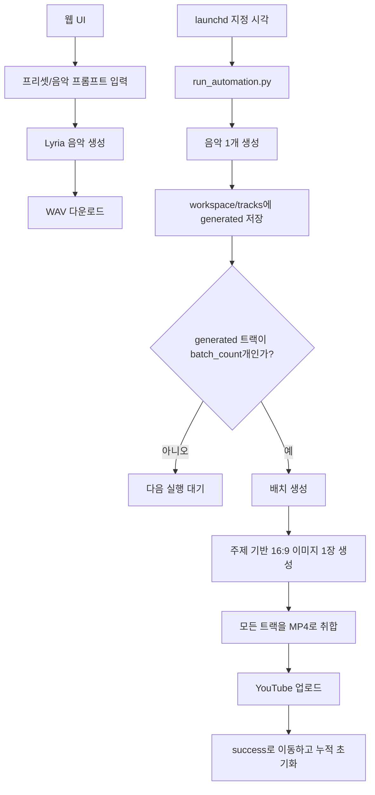

# AutoMusic 운영 가이드

AutoMusic은 두 가지 실행 방식을 제공합니다.

1. 로컬 웹 UI에서 음악 한 곡을 수동 생성하고 WAV를 다운로드합니다.
2. macOS `launchd`가 매일 음악을 하나씩 만들고, 설정된 개수가 모이면 공통 이미지 1장으로 긴 MP4를 만든 뒤 YouTube에 업로드합니다.



## 설치

```bash
cd /Users/dglee/workspace/autoMusic
python3 -m venv .venv
.venv/bin/python -m pip install -r requirements.txt
cp .env.example .env
```

`.env`에는 실제 키를 입력하되 커밋하지 않습니다. `GEMINI_API_KEY`, `OPENAI_API_KEY`, YouTube OAuth 값이 필요하며 Gmail 알림은 선택입니다.

## 수동 웹 생성

웹 생성은 이미지와 영상을 만들지 않고 음악 WAV만 생성합니다. YouTube 업로드도 수행하지 않습니다.

```bash
.venv/bin/python scripts/run_web.py
```

브라우저에서 [http://127.0.0.1:8765](http://127.0.0.1:8765)를 엽니다.

| 요청 | 기능 |
| --- | --- |
| `GET /api/presets` | 프리셋과 기본 음악 프롬프트 조회 |
| `POST /api/jobs` | 프리셋과 사용자 프롬프트로 음악 생성 시작 |
| `GET /api/jobs/<id>` | 작업 상태와 메타데이터 조회 |
| `GET /api/jobs/<id>/downloads/audio` | 생성된 WAV 다운로드 |

작업 상태는 `queued`, `generating_music`, `completed`, `failed`입니다. 작업 파일은 `workspace/web-jobs/<job-id>/`에 저장됩니다.

## 자동 배치 실행

`configs/category.conf`에서 카테고리를 선택하고, `configs/categories/<category>.yaml`에서 해당 카테고리의 음악 설정을 읽습니다.

```text
configs/category.conf       music_category phonk
configs/categories/phonk.yaml
configs/categories/study.yaml
configs/categories/fitness.yaml
configs/categories/cafe.yaml
configs/categories/lofi.yaml
```

카테고리 파일은 기존 설정을 재사용하는 `source`를 사용할 수 있습니다. 새로운 카테고리는 `configs/categories/fitness.yaml`처럼 독립 YAML 파일로 추가하면 됩니다.

각 카테고리 YAML의 `title_options`를 설정하면 해당 음악 분위기에 맞는 음원 제목을 사용합니다. `prompt_variants` 안에 `title_options`를 넣으면 전체 카테고리 제목보다 해당 variant의 제목이 우선됩니다.

```yaml
duration_seconds: 180
batch_count: 10
genre: Brazilian phonk
image_context: workout music video
```

현재 기본 카테고리는 `phonk`입니다. `study`로 바꾸려면 `configs/category.conf`를 다음처럼 수정합니다.

```text
music_category study
```

매일 음악 하나만 생성합니다.

```bash
.venv/bin/python scripts/run_daily.py \
  --config configs/categories/phonk.yaml
```

배치 개수에 도달하면 공통 이미지 생성, MP4 취합, YouTube 업로드, 아카이브를 수행합니다.

```bash
.venv/bin/python scripts/run_batch_upload.py \
  --config configs/upload.yaml \
  --music-config configs/categories/phonk.yaml \
  --batch-count 10
```

통합 실행:

```bash
.venv/bin/python scripts/run_automation.py \
  --project-root /Users/dglee/workspace/autoMusic
```

카테고리 파일을 임시로 지정할 때는 `--category-config`를 사용합니다. `--music-config`를 직접 지정하면 category 파일보다 우선합니다.

```bash
.venv/bin/python scripts/run_automation.py \
  --project-root /Users/dglee/workspace/autoMusic \
  --category-config configs/category.conf
```

## macOS 스케줄러

현재 `com.automusic.daily` LaunchAgent가 등록되어 있으며 매일 오후 `12:00`에 실행됩니다. 프로젝트 루트는 `/Users/dglee/workspace/autoMusic`이고, 실행 시 `configs/category.conf`에서 카테고리를 읽습니다.

`launchctl print` 결과의 `state = not running`은 오류가 아닙니다. 예약 시각까지 대기 중이면 정상적으로 표시됩니다.

최초 등록 또는 재등록:

```bash
cd /Users/dglee/workspace/autoMusic
.venv/bin/python scripts/install_launchd.py \
  --project-root /Users/dglee/workspace/autoMusic \
  --hour 12 \
  --minute 0
```

등록 확인:

```bash
launchctl print gui/$(id -u)/com.automusic.daily
plutil -p ~/Library/LaunchAgents/com.automusic.daily.plist
```

즉시 실행과 로그 확인:

```bash
launchctl start com.automusic.daily
tail -f logs/launchd.out.log logs/launchd.err.log
```

스케줄러 중지와 재활성화:

```bash
launchctl unload ~/Library/LaunchAgents/com.automusic.daily.plist
launchctl load ~/Library/LaunchAgents/com.automusic.daily.plist
```

예약 시간을 바꾸려면 `install_launchd.py`의 `--hour`, `--minute` 값을 변경해 재등록합니다.
```

## 폴더와 상태

```text
workspace/
├── tracks/<track-id>/
│   ├── <genre>-<variant>-<timestamp>.wav
│   └── track.json              generated 또는 batched
├── batches/<batch-id>/
│   ├── image.png                공통 16:9 이미지
│   ├── segment_*.mp4
│   ├── video.mp4
│   └── batch.json
└── web-jobs/<job-id>/           웹 수동 생성 결과

success/
├── tracks/<track-id>/
└── batches/<batch-id>/
```

배치 이미지 생성이 성공하면 `batch.json`에 `image_path`, `image_prompt`, `image_variant`가 기록됩니다. 이미지나 렌더링에서 실패하면 배치는 삭제되지 않고 다음 실행에서 재개됩니다. YouTube ID가 기록된 배치는 중복 업로드하지 않고 아카이브부터 재시도합니다.

각 트랙에는 prompt variant에 맞춘 `title`이 저장됩니다. 예를 들어 `Quiet Pages`, `Rain Between Chapters`, `One Step at a Time`처럼 생성됩니다. 음원 파일명은 이 제목을 안전하게 변환한 `<title>-<timestamp>.wav` 형식이며, 전체 음악 prompt는 같은 폴더의 `track.json`에서 확인할 수 있습니다.

## 드라이런과 검증

```bash
.venv/bin/python scripts/run_daily.py --config configs/categories/phonk.yaml --dry-run
.venv/bin/python scripts/run_batch_upload.py --config configs/upload.yaml --music-config configs/categories/phonk.yaml --batch-count 10 --dry-run
.venv/bin/python -m unittest discover -s tests -v
.venv/bin/python -m compileall -q src scripts tests
git diff --check
```

## 알림과 보안

SMTP 환경변수를 설정하면 음악 생성 성공·실패, 배치 이미지·렌더링·업로드·아카이브 실패, 최종 업로드 성공 시 Gmail 알림을 보냅니다.

`.env`, OAuth 토큰, `workspace/`, `success/`, 로그는 커밋하지 않습니다. 상세 점검은 [보안 가이드](security.md)를 따릅니다.
