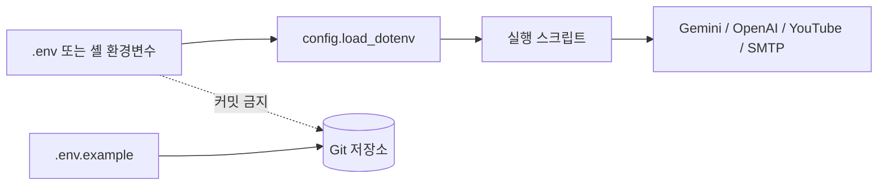

# 보안 및 커밋 안전 가이드

이 프로젝트는 API 키, OAuth 토큰, SMTP 비밀번호, 생성된 미디어, 로컬 실행 상태를 커밋하면 안 됩니다.

## 비밀값

아래 값은 `.env` 또는 셸 환경변수에만 보관합니다.

- `GEMINI_API_KEY`
- `OPENAI_API_KEY`
- `YOUTUBE_CLIENT_ID`
- `YOUTUBE_CLIENT_SECRET`
- `YOUTUBE_REFRESH_TOKEN`
- `SMTP_USERNAME`
- `SMTP_PASSWORD`
- `SMTP_FROM_EMAIL`
- `SMTP_TO_EMAIL`

커밋 가능한 파일은 빈 placeholder만 들어 있는 `.env.example`입니다.

## 커밋 금지 파일

커밋하면 안 되는 항목:

- `.env` 또는 `.env.*` 파일. 단, `.env.example`은 예외
- `client_secret*.json` 같은 Google OAuth client secret 파일
- `token*.json`, `youtube_token*.json` 같은 OAuth token 파일
- Gmail 앱 비밀번호 또는 SMTP credential export 파일
- service account credential JSON 파일
- 생성된 오디오, 이미지, GIF, 영상 파일
- `workspace/`, `success/`, `data/`, `outputs/`, `logs/` 같은 로컬 실행 폴더

## 비밀값 흐름



## 설정 파일 패턴

런타임 설정 파일은 환경변수 이름을 참조할 수 있지만, 실제 비밀값을 직접 담으면 안 됩니다.

좋은 예:

```yaml
youtube:
  client_id_env: YOUTUBE_CLIENT_ID
  client_secret_env: YOUTUBE_CLIENT_SECRET
  refresh_token_env: YOUTUBE_REFRESH_TOKEN
```

나쁜 예:

```yaml
youtube:
  client_secret: real-secret-value
  refresh_token: real-refresh-token
```

## 커밋 전 수동 점검

커밋 전 아래 명령을 실행합니다.

```bash
git status --short --untracked-files=all
git diff --cached --stat
git grep --cached -n -i -E "(api[_-]?key|secret|refresh[_-]?token|access[_-]?token|client[_-]?secret|authorization:|bearer )" -- .
```

스캔 결과가 placeholder, 문서 예시, 환경변수 이름만 보여준다면 커밋해도 됩니다. 실제 키나 토큰 값이 나오면 즉시 제거해야 합니다.
