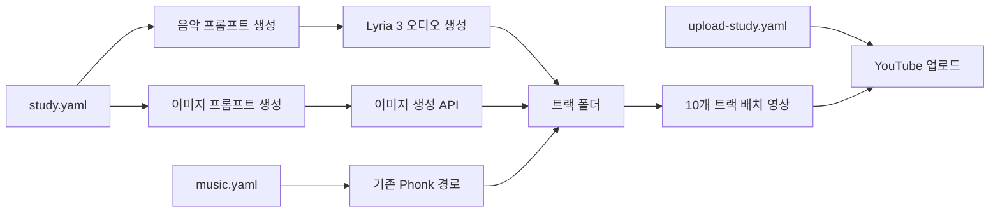

# 공부 집중 음악 프리셋 설계

## 목표

기존 Brazilian phonk 운동 음악 자동화는 그대로 유지하면서, 공부와 딥워크에 맞는 3분 길이의 무보컬 집중 음악을 별도 설정으로 생성한다. 음악의 구성, 배경 이미지, YouTube 업로드 메타데이터가 모두 공부용 콘셉트로 일관되게 생성되어야 한다.

## 선택한 접근

별도 프리셋 방식을 사용한다.

- 기존 `configs/examples/music.yaml`과 `configs/examples/upload.yaml`은 phonk 운동 채널용으로 보존한다.
- 새 `study.yaml`과 `upload-study.yaml`을 추가하여 수동 실행 또는 스케줄러에서 명시적으로 선택한다.
- 프롬프트 생성기의 운동 고정 문구를 설정 가능한 컨텍스트로 바꾸되, 기존 설정을 쓰는 경우의 기본 출력은 바꾸지 않는다.

이 방식은 채널 콘셉트를 바꿔도 과거 phonk 생성 및 배치 업로드에 영향을 주지 않고, 나중에 수면 음악이나 카페 음악 같은 프리셋을 추가할 때도 재사용할 수 있다.

## 구성과 데이터 흐름

## 설정 인터페이스

`study.yaml`에는 다음을 둔다.

- `genre`: Study focus ambient 또는 lo-fi study.
- `music_context`: `deep study and concentration sessions`처럼 음악의 사용 목적을 설명한다.
- BPM 범위, 분위기, 악기, 질감, 무보컬 규칙, 재시도 설정.
- 정적인 루프, 갑작스러운 드롭, 공격적인 드럼, 긴 무음, 갑작스러운 종료를 제한하는 규칙.
- 여러 `prompt_variants`: 조용한 도서관, 빗소리 창가 피아노, 야간 Rhodes, 미니멀 펄스, 부드러운 카페 재즈 등의 분위기와 각기 다른 타임라인.
- `image_context`: `study focus music video`.
- 여러 `image_variants`: 미니멀 책상, 비 오는 창가 도서관, 야간 작업 공간, 앰비언트 책장. 텍스트, 로고, 워터마크는 금지한다.

`upload-study.yaml`에는 공부 음악 채널에 맞는 제목, 설명, 태그를 둔다. 기본 공개 상태와 카테고리는 기존 업로드 설정의 안전한 기본값을 따른다.

## 프롬프트 생성기 변경

`build_music_prompt_with_metadata`는 `music_context`가 있을 때 이를 첫 문장에 사용한다. 값이 없으면 기존의 `intense workout sessions`를 기본값으로 써서 phonk 프롬프트의 호환성을 유지한다.

`build_image_prompt_with_metadata`는 `image_context`가 있을 때 이를 16:9 배경 이미지의 용도로 사용한다. 값이 없으면 기존의 `workout music video`를 기본값으로 쓴다. 이미지의 스타일, 주제, 팔레트, 질감은 기존처럼 선택된 이미지 변형에서 읽는다.

## 검증

- 새 컨텍스트가 음악 프롬프트와 이미지 프롬프트에 각각 반영되는 단위 테스트를 먼저 작성한다.
- 기존 phonk 설정에는 운동 문구와 기존 이미지 안전 규칙이 유지되는 회귀 테스트를 둔다.
- 전체 단위 테스트, 파이썬 컴파일 검사, YAML 설정 로드 검사, 공부 프리셋 dry-run을 실행한다.
- 실제 Lyria 또는 이미지 API 호출은 비용이 발생할 수 있으므로 이 변경에서는 실행하지 않는다.

## 비범위

- 기존 phonk 트랙, 배치, 성공 폴더의 이동은 수정하지 않는다.
- 스케줄러는 현재 중지 상태를 유지한다. 공부 프리셋으로 재설치 또는 재활성화하지 않는다.
- YouTube 실제 업로드 및 외부 API 키 변경은 수행하지 않는다.
