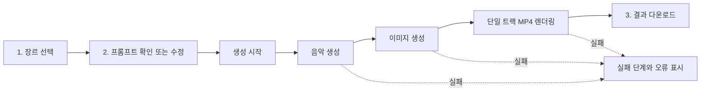

# 로컬 웹 음악 생성기 설계

## 목표

기존 AutoMusic 파이프라인을 로컬 웹 화면에서 실행할 수 있게 한다. 사용자는 Brazilian phonk 또는 공부 집중 음악을 선택하고, 기본 음악 프롬프트를 확인하거나 직접 수정한 뒤, 음악·배경 이미지·MP4를 생성하고 다운로드한다.

## 사용자 흐름

단계형 생성 마법사를 사용한다.

1. 첫 화면에서 `Brazilian phonk` 또는 `공부 집중 음악` 프리셋을 선택한다.
2. 선택한 프리셋의 기본 음악 프롬프트를 텍스트 영역에 표시한다.
3. 사용자는 기본 프롬프트를 그대로 쓰거나 원하는 새 프롬프트로 바꾼다.
4. 생성 버튼은 백그라운드 작업을 시작하고 곧바로 작업 ID와 진행 화면을 반환한다.
5. 화면은 음악, 이미지, 영상 단계의 상태를 자동 갱신한다.
6. 완료된 작업에서 WAV, PNG, MP4를 각각 내려받는다.

## 기술 구조

- Python Flask 서버를 새 웹 진입점으로 사용한다. 현재 프로젝트가 Python 스크립트 중심이므로 새 JavaScript 빌드 체인을 도입하지 않는다.
- HTML, CSS, 순수 브라우저 JavaScript로 단계형 화면을 만든다.
- `ThreadPoolExecutor`가 한 요청의 생성 작업을 백그라운드에서 처리한다. UI 요청 스레드는 API 응답과 상태 조회만 담당한다.
- 웹 서버는 기존 Lyria 음악 생성 함수와 이미지 생성 함수를 그대로 호출한다.
- 단일 트랙 렌더링 함수를 추가해 해당 작업의 WAV와 PNG를 180초 MP4로 합친다. 기존 10개 트랙 배치 렌더링은 변경하지 않는다.
- 각 작업은 `workspace/web-jobs/<job-id>/`에 저장한다. 해당 폴더의 JSON 상태 파일에는 프리셋, 실제 사용한 음악 프롬프트, 단계별 상태, 산출물 상대 경로, 오류 메시지를 저장한다.

## HTTP 인터페이스

| 경로 | 역할 |
| --- | --- |
| `GET /` | 단계형 생성 화면 제공 |
| `GET /api/presets` | 두 프리셋의 이름과 기본 프롬프트 제공 |
| `POST /api/jobs` | 프리셋과 선택적 사용자 프롬프트로 작업 생성 |
| `GET /api/jobs/<job-id>` | 진행 상태와 완료 산출물 제공 |
| `GET /api/jobs/<job-id>/downloads/<asset>` | WAV, PNG, MP4 다운로드 |

서버는 기본적으로 `127.0.0.1`에만 바인딩한다. 작업 ID와 파일 이름은 서버가 검증하며, 브라우저가 임의의 파일 경로를 요청할 수 없다.

## 프리셋과 프롬프트

- `music.yaml`은 기존 Brazilian phonk 프리셋으로 유지한다.
- `study.yaml`은 공부 집중 음악 프리셋으로 추가한다.
- 선택된 프리셋의 `music_context`와 `image_context`를 프롬프트 생성기에 전달한다.
- 사용자가 음악 프롬프트를 수정하면 그 텍스트를 Lyria 요청에 그대로 사용한다.
- 이미지 프롬프트는 선택된 장르의 이미지 변형과 시각 콘셉트를 사용해 만든다. 따라서 임의의 음악 프롬프트를 입력해도 phonk 또는 공부 음악의 채널 비주얼은 유지된다.

## 상태와 오류 처리

작업 상태는 `queued`, `generating_music`, `generating_image`, `rendering_video`, `completed`, `failed` 중 하나다.

- 기존 Lyria 재시도 설정은 유지한다.
- 어느 단계에서 예외가 발생하더라도 작업 전체가 `failed`로 기록되고, 사용자에게 단계명과 안전하게 정리된 오류 메시지를 표시한다.
- 성공한 선행 산출물은 보존한다. 예를 들어 영상 렌더링이 실패해도 생성된 WAV와 PNG는 내려받을 수 있다.
- 실패 작업은 자동으로 YouTube 업로드나 성공 폴더 이동을 실행하지 않는다.

## 보안

- Gemini, OpenAI, SMTP, YouTube API 자격 증명은 `.env` 또는 실행 환경에서만 읽는다.
- 프론트엔드 응답, 작업 JSON, 로그, 다운로드 파일 이름에 비밀값을 저장하거나 반환하지 않는다.
- 로컬 서버는 기본적으로 외부 네트워크에 공개하지 않는다.
- 사용자 프롬프트는 일반 텍스트로만 저장하고, 웹 페이지에 표시할 때 HTML 이스케이프한다.

## 검증

- 프리셋 목록, 사용자 프롬프트 우선순위, 작업 상태 조회, 다운로드 파일 검증을 단위 테스트한다.
- 실제 API 호출 없이 음악·이미지·렌더러 대체 함수를 주입하는 통합 테스트를 추가한다.
- 전체 테스트, 파이썬 컴파일 검사, 형식 검사, Flask 서버의 로컬 시작 확인을 실행한다.
- 실제 생성은 비용이 발생할 수 있어 구현 검증 과정에서 실행하지 않는다.

## 비범위

- 사용자 인증, 외부 공개, 다중 사용자 큐는 포함하지 않는다.
- YouTube 업로드는 웹 생성기 완료 흐름에 포함하지 않는다.
- 기존 매일 실행 스케줄러는 중지 상태를 유지하며, 웹 서버가 이를 재활성화하지 않는다.
